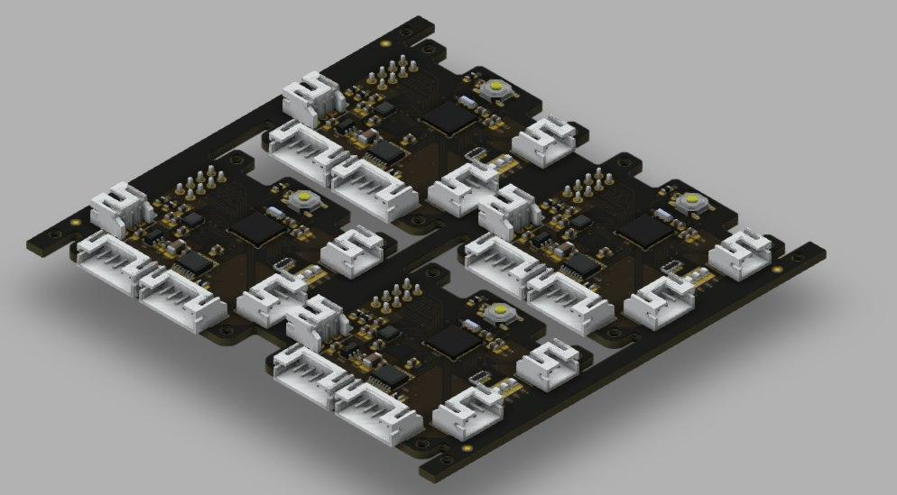

# Robots board v1.2
In this repository you can find libraries for fast start with robots board v1.2 (panel of 4 boards on the picture) software development.
 
 

This repository is made really poorly, but now it is the best i can do. Will try to improve it with time.

## What files are in here?
1. rb1_2.h/.c - files with all the hardware setup and basic usefull functions for the board
2. (not yet) motor library
3. (not yet) working nrf library

## How to use this files?

## To do list
- [ ] write clock setup;
- [ ] write USART handler;
- [ ] write NRF24 handler;
- [ ] write code for speed and position control;
- [ ] write ICM-20600 handler;

### Сторонние мысли

- [ ] Можно написать функцию инициализации, в которой будет будет много логических переменных аля init(int32_t LEDs, int32_motor1 ...). Соответственно внутри кода будут проверки (if(LED > 1)

- [ ] Пока просто любопытно, что эффкетивнее, сранивать == или сравнивать > < по командам ассемблера. А также как в командах ассемблера отображается обявление RCC->чет |= чет1 | чет2 | чет3; - одной строкой или отдельной строкой на каждое или.

